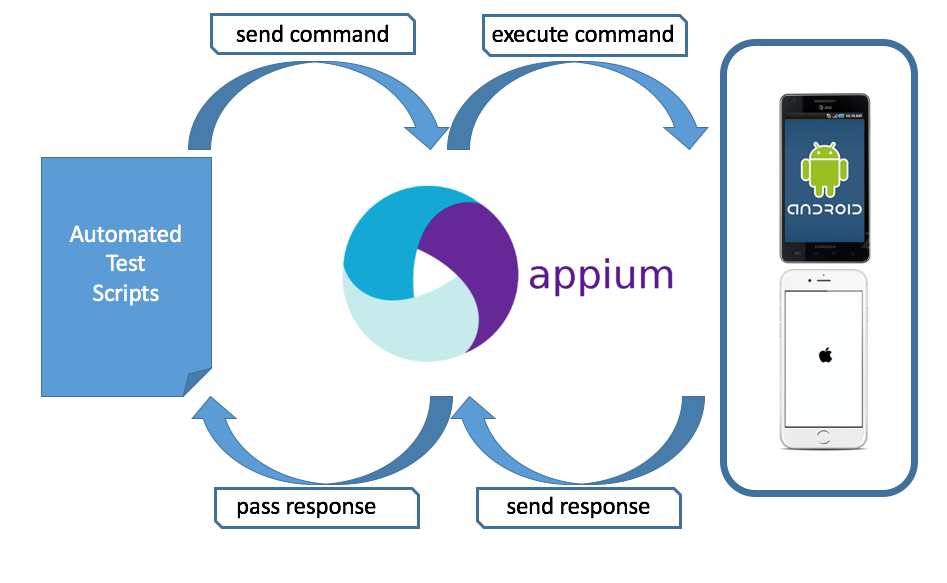
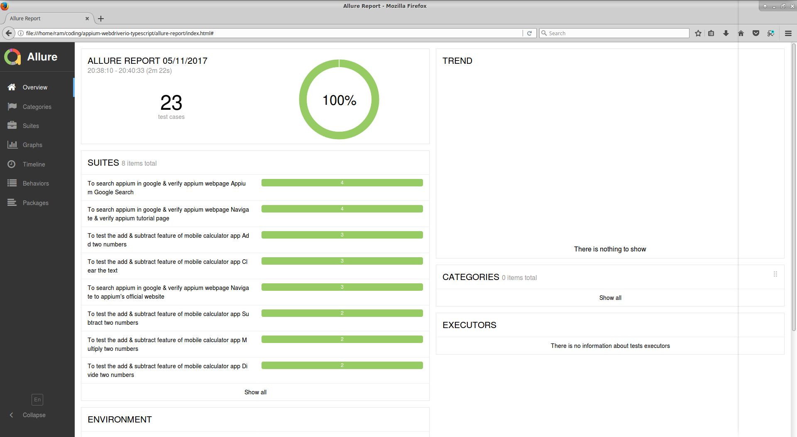

<p align="center">

</p>

<p align="center">
   <i><strong>Test framework for automating mobile apps with appium using webdriverio &amp; typescript!
</strong></i>
<p>

---

### <p align="center"> [About](#about) **|** [Getting Started](#getting-started) **|** [Installation](#installation) **|** [Writing Tests](#writing-tests) **|** [Page Objects](#page-objects) **|** [Finding Elements](#finding-elements) **|** [Reports](#reports)</p>

## About

Currently this framework has been developed to run scripts in **ANDROID** platform.

The tests run both on **Android Hybrid App** and **Mobile Browser**. Chrome browser is configured currently for running browser tests.

### Tech Stack

-   [Appium]() - This is the node server which interacts with the mobile devices
-   [WebdriverIO](http://webdriver.io/) - It is the selenium webdriver api bindings for node.js, It has a very simple api which could be used to automate web & browser apps in a fast and scalable way.
-   [Typescript(Javascript)](https://www.typescriptlang.org/) - It is the superset of javascript which has additional static typings and features like JAVA and other languaes. Now you could write your code which compiles to pure javascript.

## Getting Started

### Pre-requisites

1. NodeJS installed globally in the system.
   https://nodejs.org/en/download/

2. JAVA(jdk) installed in the system.

3. Andriod(sdk) installed in the system.

4. Set **JAVA_HOME** & **ANDROID_HOME** paths correctly in the system.

5. Chrome browser installed.

6. Text Editor/IDE installed-->Sublime or Visual Studio Code.

**Tip:** Install `npm install -g appium-doctor` and run it from the command-line which checks if your java jdk and android sdk paths are set correctly or not.

## Installation

### Setup Scripts

-   Go inside the folder and run following command from terminal/command prompt

```
npm install
```

-   All the dependencies from package.json and typescript typings would be installed in node_modules folder.

**Tip:** Use [**Yarn**](https://yarnpkg.com/en/docs/installing-dependencies) to install your modules `npm install -g yarn` as it caches & locks them which would help us install correct versions of modules across various platforms without any issues. This project is configured with `yarn.lock` file. So you could make use of it.

### Run Tests

-   First step is to start the `appium` server, This project includes the appium node module so you don't have to download it externally. You can run the appium server by the following npm command.

```
npm run appium --chromedriver-executable /path/to/user/chromedriver
```

**Note:** The chromedriver used has to be the same version as the chrome broswer on the emulator.

-   Next you have to transpile/compile your typescript files to javascript files, you could do this by running the command -

```
npm run build
```

Next step is to execute the config files. This project has 2 config files -

-   [wdio.android.app.conf.ts](./config/wdio.android.app.conf.ts) - This config file is used to run tests in emulator browser or hybrid apps.
    You would have to change the `appium settings` to run tests in your device.

```
config.capabilities = [
    {
        platformName: 'Android',
        maxInstances: 1,

        'appium:deviceName': 'Nexus_5_API_27',
        'appium:platformVersion': '8.1',
        'appium:orientation': 'PORTRAIT',
        'appium:automationName': 'UiAutomator2',
        'appium:app': join(
            process.cwd(),
            '../frontend/android/app/build/outputs/apk/debug/app-debug.apk'
        ),
        'appium:noReset': true,
        'appium:newCommandTimeout': 240,
        browserName: 'chrome'
    }
];
```

To know your device name you could run the `adb devices` command which comes out of the box from Android SDK.

The node command to run hybrid app tests of this project is -

```
npm run android.app
```

The above command which is set in `package.json` internally calls the WebdriverIO's binary `wdio ./typeScript/config/wdio.android.app.conf.js` and runs the app config file.

## Writing Tests

Mocha and chai frameworks are used in this project to create tests like in the following example:

```
import LandingScreen from '../screenobjects/landingScreen';
import deliveryOrPickupScreen from '../screenobjects/deliveryOrPickupScreen';

import { appLoginWithDeepLink } from '../../helpers';
import { switchToContext, CONTEXT_REF } from '../../helpers/webview';

describe('WebdriverIO and Appium', () => {
    it('should be able to place an order successfully', () => {
        console.log('start testing');
        appLoginWithDeepLink();

        switchToContext(CONTEXT_REF.WEBVIEW);

        LandingScreen.orderNowButton.click();
        deliveryOrPickupScreen.pickupButton.click();

        console.log('The end');
    });
});
```

## Page Objects

This framework is strictly written using page-object design pattern.

```
import Screen from './screen';

const SELECTORS = {
    ORDER_NOW: "//button[text() = 'Order Now']"
};

class LandingScreen extends Screen {
    constructor() {
        super(SELECTORS);
    }

    get orderNowButton() {
        $(SELECTORS.ORDER_NOW).waitForDisplayed(30000);
        return $(SELECTORS.ORDER_NOW);
    }
}

export default new LandingScreen();
```

## Finding-Elements

Finding elements in mobile hybrid apps and browser is the same using selector strategies such as id, xpath or css [**wdio selectors**](https://webdriver.io/docs/selectors.html).

## Reports

Currently this project has been integrated with [Allure-Reports](http://allure.qatools.ru/). WebdriverIO's `wdio-allure-reporter` helps us generate detailed reports of our mobile automated tests.
Once the test execution is finished, run the following commands to generate **HTML Report** and you would find the **allure-results** folder generated.

```
generate-report
open-report
```




